# POWER PUFF CELEB Commerce

셀럽·인플루언서가 소개한 상품을 발견하고, 콘텐츠를 살펴본 뒤, 제휴몰 구매 링크로 이동하는 커머스 큐레이션 서비스입니다. 운영자는 같은 애플리케이션의 비공개 CMS에서 상품·카테고리·영상·광고를 관리합니다.

이 프로젝트는 일반적인 게시글 서비스가 아닙니다. 핵심 도메인은 `상품 콘텐츠`, `셀럽 카테고리`, `가격 비교`, `제휴 전환`, `스토어프런트 운영`입니다. 소스 코드도 이 방향에 맞춰 `commerce-studio`, `Storefront`, `Catalog` 용어를 사용합니다.

> 일부 저장 키, Netlify 함수 URL, Supabase 테이블에는 `blog`라는 이전 이름이 남아 있습니다. 이미 배포된 데이터와 URL을 깨지 않기 위한 호환 계약이며 신규 코드의 도메인 명칭으로 사용하지 않습니다.

## 1. 제품 기획서

### 1.1 제품 한 줄 정의

파워퍼프셀럽은 소셜 미디어에서 화제가 된 셀럽 상품을 콘텐츠로 설명하고, 사용자가 신뢰할 수 있는 구매 경로까지 빠르게 연결하는 에디토리얼 커머스입니다.

### 1.2 해결하려는 문제

- 사용자는 영상이나 SNS에서 본 상품의 정확한 이름과 구매처를 다시 찾기 어렵습니다.
- 같은 상품도 판매처마다 가격·혜택·배송 조건이 다릅니다.
- 운영자는 상품 설명, 이미지, 셀럽 분류, 광고, SEO 정보를 여러 도구에서 중복 관리하기 쉽습니다.
- 정적인 상품 페이지는 발견의 재미가 약하고, 일반적인 콘텐츠 도구는 구매 전환 구조가 부족합니다.

### 1.3 핵심 사용자

| 사용자 | 목적 | 성공 기준 |
| --- | --- | --- |
| 방문자 | 화제의 상품 발견 | 카테고리 또는 BEST 영역에서 관심 상품 진입 |
| 구매 의향 사용자 | 상품 이해와 가격 비교 | 상품 설명 확인 후 적절한 제휴몰 링크 선택 |
| 운영자 | 콘텐츠와 노출 영역 관리 | 별도 배포 없이 상품·영상·배너 수정 |
| 검색 엔진 | 공개 콘텐츠 수집 | 상품·카테고리별 메타데이터와 구조화 데이터 해석 |

### 1.4 핵심 가치

1. `Discovery` — 셀럽 중심 탐색과 BEST 슬라이더로 상품을 발견합니다.
2. `Editorial trust` — 표지, 본문, 파워퍼프셀럽 네컷, 설명을 통해 구매 전 맥락을 제공합니다.
3. `Commerce clarity` — 판매처별 가격·배지·CTA를 한곳에서 비교합니다.
4. `Operational speed` — 운영 화면에서 저장하면 공개 화면에 빠르게 반영됩니다.
5. `Search reach` — 상품과 카테고리에 독립 URL, JSON-LD, sitemap을 제공합니다.

### 1.5 기능 범위

#### 스토어프런트

- 공개 상품만 최신순으로 노출
- 셀럽/인플루언서 카테고리 탐색 및 이미지형 레일
- BEST 상품 자동 슬라이드
- 유튜브 무음 자동재생 추천 영역
- 이미지·문구형 배너와 외부 제휴 광고 태그
- 상품 상세 다이얼로그, 이미지 갤러리, 파워퍼프셀럽 네컷, 본문, 판매처 링크
- 이전/다음 상품 이동, 공유, URL history 동기화
- 모바일·태블릿·데스크톱 반응형 화면

#### 운영 CMS

- 상품 생성, 수정, 복제, 삭제, 상태 변경
- 카테고리 생성, 이름 변경, 삭제, 순서 변경, 대표 이미지 관리
- 표지/본문/상세 이미지 최적화 업로드
- TipTap 기반 리치 텍스트, 링크, 표, 코드 블록, 색상 편집
- 판매처 링크·가격·배지 편집
- 파워퍼프셀럽 네컷 4장과 설명의 발행 조건 검증
- 영상·스티커·광고 배너·외부 광고 태그 설정
- JSON 백업 내보내기/가져오기
- 비밀번호와 서버 저장 토큰 기반 운영 모드

#### 배포·검색

- Netlify Functions 기반 데이터 API
- Supabase Postgres 저장과 Storage 이미지 외부화
- 공개 목록 경량 응답과 상품 상세 지연 로딩
- 상품/카테고리 서버 렌더형 SEO 응답
- 동적 `robots.txt`, `sitemap.xml`, canonical, Open Graph, JSON-LD
- 레거시 서비스 워커 자동 해제와 정적 자산 장기 캐시

## 2. 경험 설계

### 2.1 방문자 여정

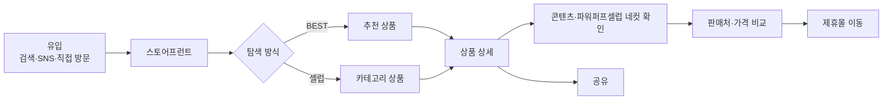

### 2.2 운영자 여정

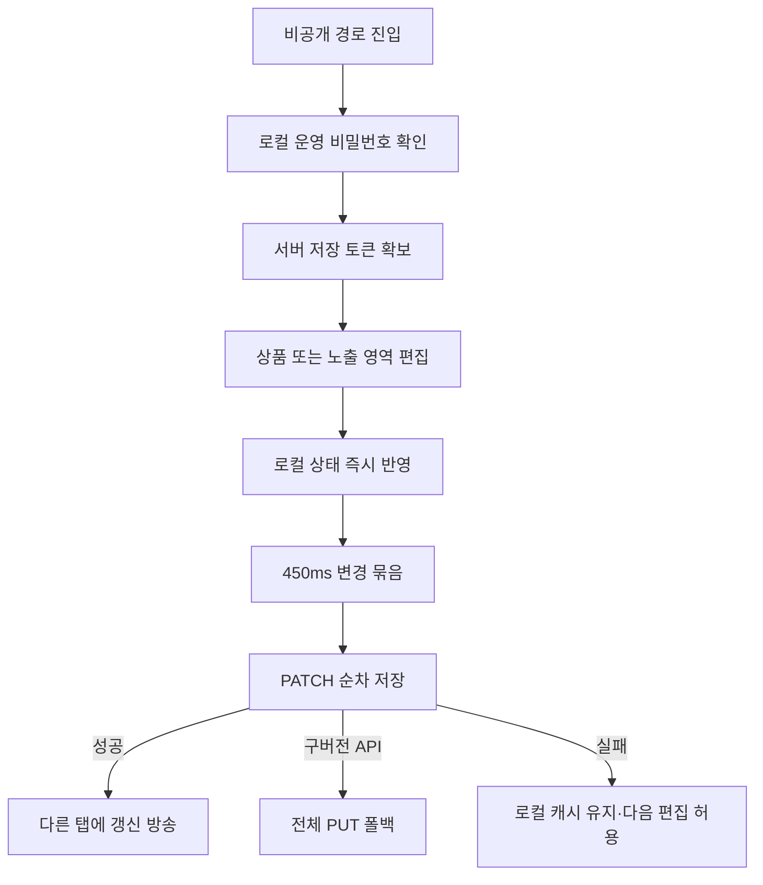

### 2.3 콘텐츠 상태

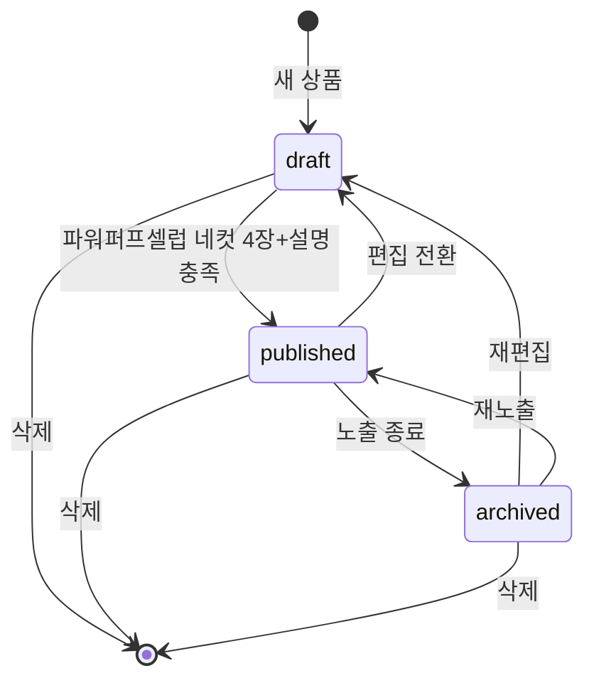

`published`만 공개 화면과 SEO 응답에 포함됩니다. 발행 시 파워퍼프셀럽 네컷 이미지와 설명 네 쌍을 모두 요구해 불완전한 상세 페이지가 노출되는 것을 막습니다.

## 3. 기술 아키텍처

### 3.1 시스템 컨텍스트

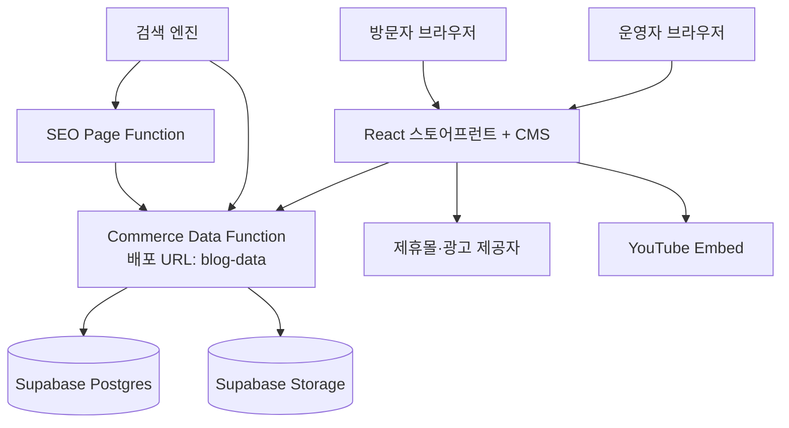

### 3.2 프런트엔드 계층

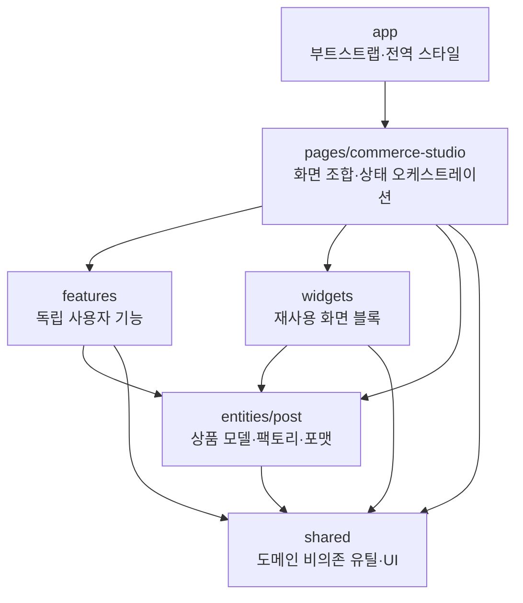

의존성은 위에서 아래로만 흐릅니다. `shared`가 페이지를 import하거나, `entity`가 특정 화면을 아는 역방향 의존성은 허용하지 않습니다. 외부에서 페이지를 사용할 때는 `pages/commerce-studio/index.ts`의 공개 API를 통합니다.

### 3.3 커머스 스튜디오 내부

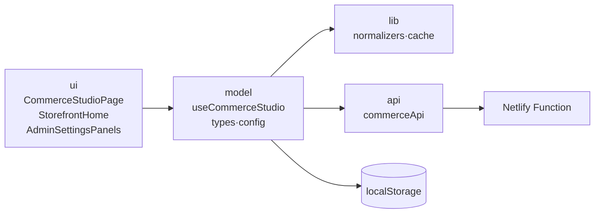

- `ui`: DOM 구조, 접근성 속성, 이벤트 연결을 담당합니다.
- `model`: 화면 상태와 유스케이스를 조합합니다.
- `lib`: 외부 데이터를 정규화하고 경량 캐시를 만드는 순수 규칙입니다.
- `api`: 인증 헤더, PATCH 큐, PUT 폴백, 런타임 endpoint를 캡슐화합니다.
- `config`: 기본값과 이전 배포 호환 키를 단일 위치에서 관리합니다.

### 3.4 디렉터리 구조

```text
src/
├── app/                         # 앱 엔트리와 전역 스타일
├── pages/
│   └── commerce-studio/
│       ├── api/                 # 원격 저장소 게이트웨이와 계약 테스트
│       ├── lib/                 # 정규화·캐시 규칙과 단위 테스트
│       ├── model/               # 상태 모델, 타입, 호환 설정
│       ├── ui/                  # 스토어프런트와 운영 화면
│       └── index.ts             # 페이지 공개 API
├── features/
│   └── post-editor/             # 리치 상품 콘텐츠 편집
├── entities/
│   └── post/                    # 상품 엔터티와 도메인 유틸
├── widgets/                     # 카탈로그 사이드바, 상단바, 미리보기 등
├── shared/                      # 범용 파일·저장·SEO·UI 유틸
└── main.tsx

netlify/functions/
├── blog-data.ts                 # 레거시 URL을 유지하는 커머스 데이터 API
└── seo-page.ts                  # 상품·카테고리 SEO HTML 응답

supabase/schema.sql              # 기존 운영 데이터 호환 스키마
```

## 4. 특별 요소별 설계

### 4.1 첫 방문 초기화와 스켈레톤

새로고침 직후 React가 실행되기 전에는 `index.html`의 POWER PUFF CELEB 로고·레드 스피닝 로더가 표시됩니다. React가 마운트된 뒤 캐시가 없는 첫 방문에서는 starter 상품이나 샘플 광고를 렌더하지 않고, 원격 스냅샷이 확정될 때까지 실제 화면과 유사한 높이의 스켈레톤을 사용합니다. 검증 가능한 상품·설정 캐시가 모두 있는 재방문은 캐시를 즉시 보여주고 백그라운드에서 최신 데이터를 동기화합니다.

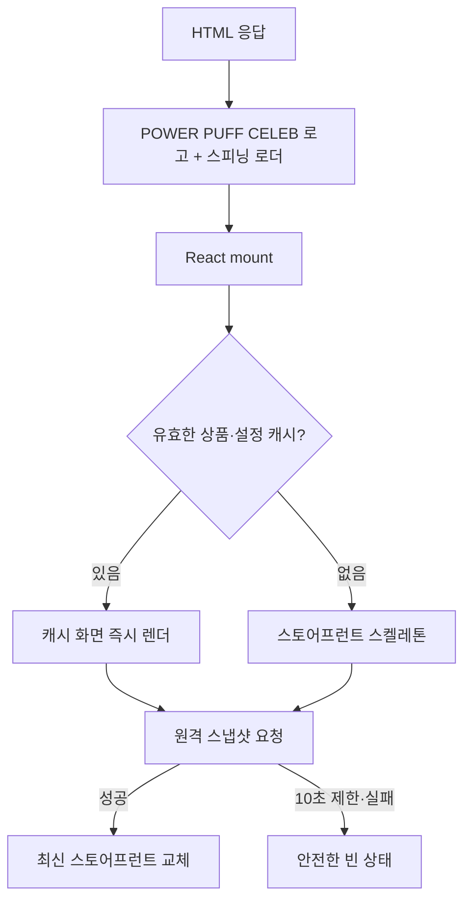

부트 로더와 스켈레톤은 상태 label을 제공하고 `prefers-reduced-motion`에서는 회전·shimmer 애니메이션을 끕니다. 부트 로더의 진행 막대는 이동 대신 느린 명암 변화로 로딩 상태를 알립니다. 캐시가 있는 앱 새로고침에서도 로더를 첫 프레임부터 최소 850ms 표시하고, 앱 복귀 시 중단된 부트 애니메이션을 다시 시작합니다. 네컷 상세는 사진별 로딩 중 카메라 촬영 애니메이션을 표시하며, 로드 실패 시 다시 불러오기 버튼을 제공합니다. JavaScript가 비활성화된 경우에는 `<noscript>`의 서비스 설명이 대신 표시됩니다.

### 4.2 공개 목록과 상세의 분리 로딩

초기 화면은 본문과 인라인 이미지를 모두 받지 않습니다. 경량 summary를 먼저 표시하고 사용자가 상품을 열 때 상세를 요청합니다.

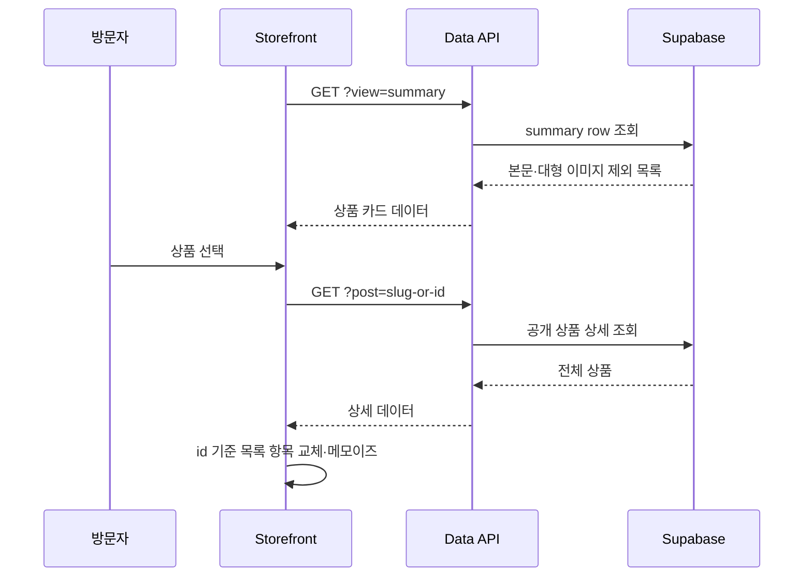

효과는 빠른 첫 렌더, 작은 localStorage 직렬화 비용, 필요한 상세만 전송하는 네트워크 효율입니다.

### 4.3 안전한 부분 저장

편집 때마다 전체 콘텐츠를 업로드하지 않습니다. 이전 스냅샷과 현재 상태의 참조를 비교하고, 바뀐 상품은 필드 단위 patch로 만듭니다.

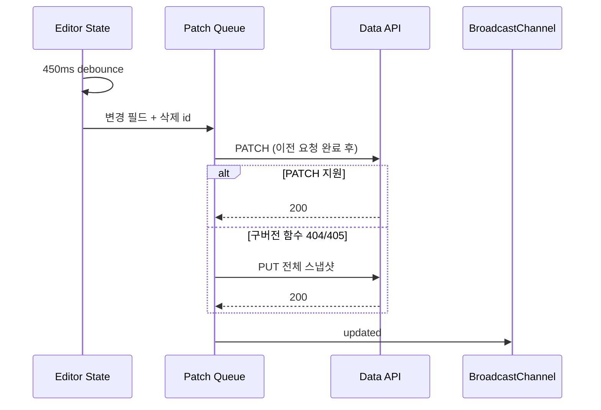

큐를 직렬화하는 이유는 먼저 시작한 느린 요청이 최신 편집을 나중에 덮어쓰는 경쟁 조건을 차단하기 위해서입니다.

### 4.4 이미지 파이프라인

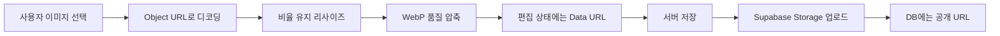

표지와 본문은 최대 1600px, 카테고리는 720px, 배너는 2100px 기준으로 최적화합니다. 공개 브라우저 캐시에는 큰 Data URL을 제거해 저장 공간 초과와 입력 지연을 줄입니다.

### 4.5 외부 광고 격리

제휴사가 제공한 `<script>` 또는 `<iframe>`은 애플리케이션 DOM에 직접 삽입하지 않습니다.

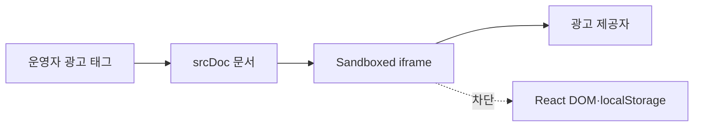

iframe은 `allow-forms allow-popups allow-popups-to-escape-sandbox allow-scripts`만 허용합니다. 광고는 팝업과 스크립트를 실행할 수 있지만 부모 앱의 same-origin 권한은 받지 않습니다.

### 4.6 URL과 SEO

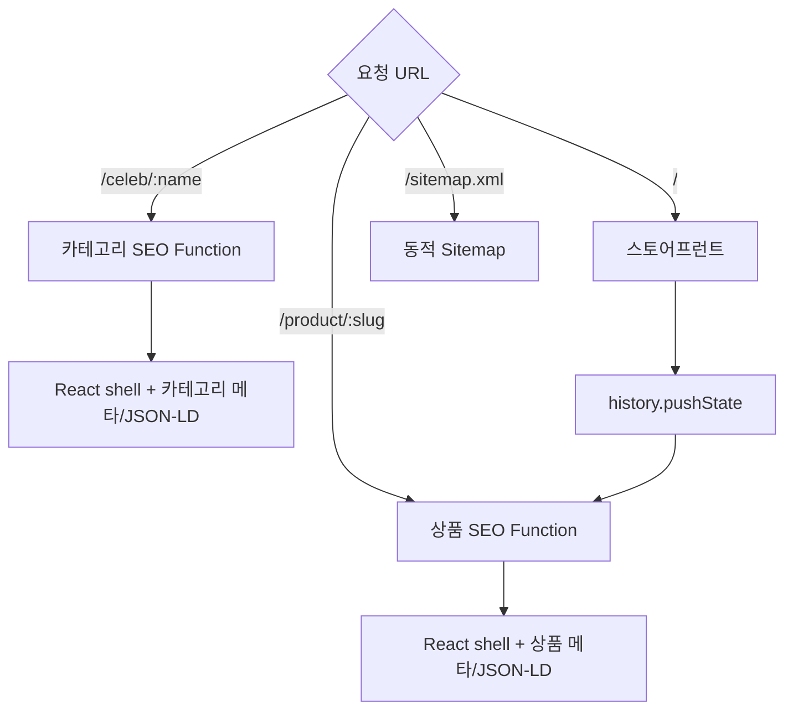

브라우저에서는 history API로 상세/필터 URL을 유지하고, 검색 엔진의 직접 요청에는 Netlify Function이 완성된 메타데이터를 포함한 HTML을 제공합니다.

### 4.7 운영 인증 경계

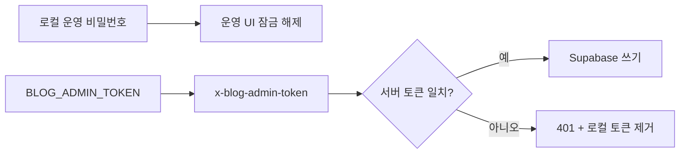

로컬 비밀번호는 UI 진입 장벽일 뿐 서버 보안 수단이 아닙니다. 실제 쓰기 권한은 서버 환경변수 `BLOG_ADMIN_TOKEN` 검증으로 결정합니다. Supabase service-role 키는 브라우저 번들에 포함하지 않습니다.

## 5. 데이터 모델

### 5.1 Product (`Post` 호환 타입)

| 필드군 | 필드 | 의미 |
| --- | --- | --- |
| 식별 | `id`, `slug` | 내부 식별자와 공개 URL 식별자 |
| 소개 | `title`, `excerpt`, `category`, `tags` | 카드·검색·SEO 기본 정보 |
| 콘텐츠 | `content`, `coverImage` | 리치 본문과 대표 이미지 |
| 파워퍼프셀럽 네컷 | `detailImages[4]`, `detailDescriptions[4]` | 고정 네 컷 상품 스토리 |
| 구매 | `purchaseTitle`, `productLinks` | 판매처·가격·배지·제휴 URL |
| 운영 | `status`, `createdAt`, `updatedAt` | 공개 상태와 정렬 기준 |

소스 타입 이름 `Post`는 저장 데이터와 넓은 코드 호환성 때문에 유지합니다. 화면과 문서에서는 Product 또는 상품 콘텐츠로 해석합니다. 다음 스키마 버전에서 데이터 마이그레이션을 동반할 때만 타입 이름 변경을 검토합니다.

### 5.2 정규화 정책

- 알 수 없는 상태는 `draft`로 복구합니다.
- 누락된 문자열은 안전한 기본값으로 채웁니다.
- 파워퍼프셀럽 네컷 배열은 항상 길이 4로 맞춥니다.
- 카테고리 앞뒤/연속 공백을 정리하고 입력 순서대로 중복을 제거합니다.
- 유효하지 않은 판매처 항목은 공개 모델에서 제외합니다.
- 이전 단일 광고 배너 백업도 현재 2개 슬롯 형식으로 읽습니다.

## 6. 기술 리뷰

### 6.1 현재 설계 평가

| 항목 | 평가 | 근거 |
| --- | --- | --- |
| 도메인 경계 | 양호 | UI, 상태, 순수 규칙, 원격 저장을 분리 |
| 데이터 호환성 | 강함 | 이전 저장 키·URL·백업을 그대로 읽음 |
| 초기 성능 | 양호 | editor lazy load, summary/detail 분리, 경량 캐시 |
| 편집 안정성 | 양호 | debounce, 순차 PATCH, PUT 폴백, 탭 갱신 |
| 검색 노출 | 강함 | 독립 경로, SSR형 메타, JSON-LD, sitemap |
| 보안 | 보완 필요 | 서버 쓰기 토큰은 안전하나 로컬 운영 비밀번호는 인증 시스템이 아님 |
| 자동 검증 | 기반 확보 | 정규화·patch 단위 테스트와 lint/type/build 통합 명령 제공 |
| 스타일 유지보수 | 개선 필요 | 누적된 전역 CSS cascade가 크며 시각 기준선 확보 후 단계적 분리 필요 |

### 6.2 이번 구조 개선 내용

- 제품 명칭을 콘텐츠 블로그에서 커머스 스튜디오/스토어프런트로 전환했습니다.
- 1,100줄 상태 파일에서 타입, 설정, 정규화, 캐시, 원격 저장 책임을 분리했습니다.
- 관리자 영상/배너 폼을 독립 프레젠테이션 컴포넌트로 추출했습니다.
- 공개 미디어·광고 렌더링을 `StorefrontMedia`로 분리했습니다.
- 저장 토큰 처리와 네트워크 폴백 중복을 하나의 API 게이트웨이로 통합했습니다.
- 순수 데이터 규칙과 cloud patch 생성에 회귀 테스트를 추가했습니다.
- 첫 방문의 샘플 데이터 깜빡임을 캐시 인식형 스켈레톤과 10초 요청 제한으로 제거했습니다.
- import되지 않는 이전 대시보드·통계·플로팅 메뉴와 템플릿 자산을 제거했습니다.
- 페이지 공개 API를 추가해 앱 계층이 내부 파일 구조에 결합되지 않게 했습니다.
- 프로젝트 이름과 명령을 `powerpuffceleb-commerce` 기준으로 정리했습니다.
- 이 README에 제품 정의, 구조, 운영 규칙, 특별 요소 설계를 통합했습니다.

### 6.3 의도적으로 유지한 호환 요소

| 요소 | 유지 이유 | 변경 조건 |
| --- | --- | --- |
| `/.netlify/functions/blog-data` | 검색·배포·클라이언트가 참조하는 공개 URL | alias 배포 후 단계적 전환 |
| `blog_content` 테이블 | 운영 데이터가 저장된 물리 스키마 | 검증된 DB migration 필요 |
| `solo-commerce-blog-*` 키 | 기존 운영자 브라우저 데이터 보존 | 읽기 migration과 롤백 전략 필요 |
| `/blog/*` 경로 인식 | GitHub Pages 및 이전 공유 링크 | redirect 운영 기간 종료 후 |
| 일부 `.public-blog`, `.blog-code-block` 클래스 | 화면 픽셀·스타일 cascade 보존 | 시각 회귀 테스트 도입 후 |
| `Post` 타입 이름 | 저장/편집 전반의 호환성과 변경 범위 | 명시적 Product schema v2에서 |

### 6.4 남은 기술 부채와 우선순위

1. 전역 CSS에 여러 디자인 시기의 override가 누적되어 있습니다. 데스크톱/모바일 골든 스크린샷을 만든 뒤 cascade layer 또는 CSS Module로 이동해야 합니다.
2. 운영 인증은 개인 운영에 맞춘 토큰 방식입니다. 다중 운영자가 필요하면 Supabase Auth, 역할 기반 권한, 감사 로그가 필요합니다.
3. `StorefrontHome`과 `PostEditor`는 기능 밀도가 높습니다. DOM 구조를 고정하는 시각 회귀 테스트를 먼저 만든 뒤 섹션별 컴포넌트로 추가 분리합니다.
4. 네트워크 오류는 현재 비차단 정책입니다. 저장 상태를 명시적으로 보여주는 retry/outbox UI가 장기적으로 필요합니다.
5. 접근성은 기본 label과 Dialog를 사용하지만 키보드·스크린리더 E2E 검증을 추가해야 합니다.

## 7. 실행과 검증

### 7.1 요구 환경

- Node.js 22 이상
- npm
- 원격 저장 기능 사용 시 Netlify와 Supabase 프로젝트

### 7.2 로컬 실행

```bash
npm install
npm run dev
```

Vite가 출력한 로컬 주소로 접속합니다. 로컬 런타임은 원격 공개 데이터를 읽고, 연결할 수 없으면 검증된 브라우저 캐시를 사용합니다. 캐시도 없으면 임의의 샘플 상품을 만들지 않고 안전한 빈 상태를 표시합니다.

### 7.3 품질 게이트

```bash
npm run check
```

이 명령은 다음을 순서대로 실행합니다.

1. `npm run lint` — React hooks와 TypeScript를 포함한 정적 검사
2. `npm test` — 정규화와 cloud patch 회귀 테스트
3. `npm run build` — TypeScript project build와 Vite production build

개별 명령도 각각 실행할 수 있습니다.

```bash
npm run lint
npm test
npm run build
npm run preview
```

### 7.4 환경 변수

| 변수 | 필수 | 용도 |
| --- | --- | --- |
| `BLOG_ADMIN_TOKEN` | 운영 저장 시 | 데이터 API 쓰기 인증 |
| `SUPABASE_URL` | 운영 저장 시 | Supabase 프로젝트 URL |
| `SUPABASE_SERVICE_ROLE_KEY` | 운영 저장 시 | 서버 전용 DB/Storage 권한 |
| `VITE_SITE_URL` | 선택 | 대표 주소 대체. 기본 `https://powerpuffceleb.co.kr`; 빌드와 함수에 동일하게 설정 |
| `GOOGLE_SITE_VERIFICATION` | 선택 | Google Search Console에서 발급한 HTML 태그 인증값, 빌드 시 반영 |
| `NAVER_SITE_VERIFICATION` | 선택 | 네이버 서치어드바이저 HTML 태그 인증값, 빌드 시 반영 |
| `BING_SITE_VERIFICATION` | 선택 | Bing Webmaster Tools HTML 태그 인증값, 빌드 시 반영 |
| `GITHUB_PAGES=true` | 선택 | `/blog/` base build |

`SUPABASE_SERVICE_KEY`, `SERVICE_ROLE_KEY`, `VITE_SUPABASE_URL`, `NEXT_PUBLIC_SUPABASE_URL`도 이전 환경 호환을 위해 읽지만 신규 환경은 표의 기본 이름을 사용합니다. service-role 키를 `VITE_*` 변수로 제공하지 마십시오.

### 7.5 Supabase 준비

1. Supabase SQL Editor에서 `supabase/schema.sql`을 실행합니다.
2. Netlify에 `SUPABASE_URL`, `SUPABASE_SERVICE_ROLE_KEY`, `BLOG_ADMIN_TOKEN`을 등록합니다.
3. 배포 후 관리자 경로에서 동일한 `BLOG_ADMIN_TOKEN` 값을 브라우저에 입력합니다.
4. 첫 저장 후 공개 화면, 상품 상세, sitemap을 확인합니다.

## 8. 협업 규칙

### 8.1 코드 책임

- 새로운 비즈니스 타입은 `entities` 또는 해당 page의 `model/types.ts`에 둡니다.
- 외부 입력은 UI에서 단정하지 않고 `normalizers.ts` 경계에서 검증합니다.
- fetch와 인증 헤더는 컴포넌트에 작성하지 않고 `api`에 둡니다.
- 재사용 가능한 사용자 행동은 `features`, 조합된 큰 화면 블록은 `widgets`에 둡니다.
- page 외부에서는 내부 경로보다 page의 `index.ts` 공개 API를 사용합니다.
- CSS 클래스 변경은 화면 계약 변경으로 취급하고 반응형 상태를 함께 검증합니다.

### 8.2 주석 규칙

주석은 한국어 서술형으로 통일하며 다음 경우에만 작성합니다.

- 코드만으로 드러나지 않는 호환성 제약
- 동시성, 보안, 성능을 위한 의사결정
- 제거하면 장애가 나는 fallback과 타이밍
- 외부 시스템의 비직관적인 계약

함수 이름을 반복하거나 JSX 구조를 번역하는 주석은 추가하지 않습니다. `왜`를 설명하고 `무엇`은 타입과 이름으로 표현합니다.

### 8.3 변경 체크리스트

- [ ] 공개 화면의 DOM 클래스와 반응형 레이아웃이 유지되는가?
- [ ] 기존 localStorage와 JSON 백업을 읽을 수 있는가?
- [ ] 공개 화면에는 `published`만 노출되는가?
- [ ] 상품 URL의 뒤로 가기/앞으로 가기가 동작하는가?
- [ ] PATCH 실패와 구버전 API 폴백을 고려했는가?
- [ ] 외부 링크에 적절한 `rel`과 안전한 protocol 검증이 있는가?
- [ ] 관리자 경로가 `noindex`인가?
- [ ] `npm run check`가 통과하는가?

### 8.4 브랜치와 커밋 권장 형식

```text
feat(storefront): add price filter
fix(sync): preserve latest patch order
refactor(editor): extract product link panel
docs(architecture): document asset pipeline
```

## 9. 운영 관측과 장애 대응

| 증상 | 확인 지점 | 대응 |
| --- | --- | --- |
| 공개 상품이 비어 있음 | Data Function 응답, Supabase 환경변수 | `?debug=env` 응답과 Netlify 로그 확인 |
| 운영 저장이 안 됨 | 401 여부, 브라우저 저장 토큰 | 운영 모드 재진입 후 토큰 재입력 |
| 이미지가 너무 큼 | Storage 업로드·DB Data URL 잔존 | 외부화 처리와 bucket 권한 확인 |
| 검색 결과 메타가 오래됨 | SEO Function, CDN cache | 함수 응답과 cache-control 확인 |
| 다른 탭 반영이 늦음 | BroadcastChannel, focus refresh | 15초 polling과 visibility 이벤트 확인 |
| 구버전 함수에서 PATCH 실패 | 404/405 후 PUT 발생 여부 | 클라이언트 폴백 확인 후 함수 재배포 |

## 10. 로드맵

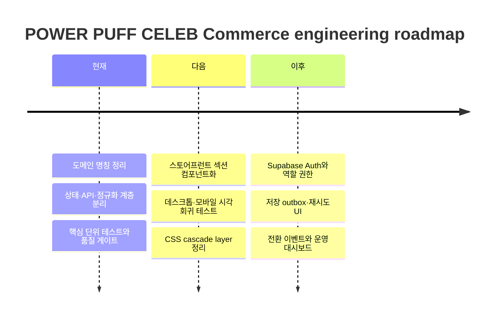

구조 개선의 최우선 원칙은 기능과 화면을 유지하는 것입니다. 대규모 스타일 정리나 물리 스키마 이름 변경은 자동화된 시각 기준선과 데이터 migration이 준비된 별도 변경으로 수행합니다.


### 파워퍼프셀럽 SEO 운영

- 브랜드 표기는 `파워퍼프셀럽 / POWER PUFF CELEB`입니다. 페이지·관리자·공유 메타·구조화 데이터·앱 이름에 동일하게 사용합니다. 색상·레이아웃을 유지하며 로고, 소녀 캐릭터 파비콘, PNG 공유 이미지를 새 브랜드 파일명으로 제공합니다. 이전 공개 이미지 주소는 새 파일로 301 이동합니다.

- 대표 주소는 `https://powerpuffceleb.co.kr`입니다. `www.powerpuffceleb.co.kr`, 기존 `ssenshop.co.kr`·`www.ssenshop.co.kr`, `ssenshop.netlify.app`의 HTTP/HTTPS 요청은 상품·셀럽 경로와 쿼리를 유지해 대표 HTTPS 주소로 301 이동합니다. 도메인 이동 규칙은 SPA/SEO rewrite보다 먼저 적용합니다.
- 기본 HTML, 공유 링크, 브라우저 canonical, 서버 SEO, robots.txt와 사이트맵은 같은 대표 주소를 사용합니다. Netlify `URL` 또는 미리보기 도메인이 검색 주소를 덮어쓰지 않습니다. 별도 운영 주소는 빌드와 함수의 `VITE_SITE_URL`을 함께 설정합니다. 이전 도메인이 환경변수에 남아 있어도 새 대표 주소로 정규화하며, 로컬 개발의 상품·투표 API도 새 운영 주소를 사용합니다.
- 홈/상품/셀럽 페이지는 초기 HTML에 제목, 설명, canonical, 구조화 데이터와 공개 상품 링크를 제공합니다. 상품의 완성된 네컷 설명도 포함합니다. 봇과 일반 방문자에게 같은 HTML을 제공합니다.
- 상품 경로는 rewrite query 전달에 의존하지 않고 원래 요청 경로와 함수 하위 경로에서 읽습니다. `/robots.txt`, `/sitemap.xml`은 전용 함수로 연결되어 query 누락이나 공유용 추적 파라미터에 영향을 받지 않습니다.
- Open Graph 기본 이미지는 1200×630 PNG입니다. 벡터 로고는 `scripts/build-brand-assets.mjs`의 전용 글자 윤곽과 큰 눈·라벤더 단발·핑크 리본의 소녀 캐릭터로 생성합니다. 로고 수정 후 `npm run build:brand`로 SVG, 공유 PNG, 파비콘을 함께 갱신합니다.
- 검색 결과용 파비콘은 `/favicon-96x96.png`, 브라우저 기본 경로는 `/favicon.ico`(32·48px), Apple 홈 화면 아이콘은 `/apple-touch-icon.png`(180px)입니다. 웹 앱 매니페스트에는 192·512px PNG도 제공합니다. `scripts/build-favicons.mjs`가 기존 캐릭터 SVG에서 생성하며 `npm run build`에도 포함됩니다. 배포 후 Search Console URL 검사에서 홈 URL의 색인 생성을 요청할 수 있습니다. 검색 결과 아이콘은 Google 재수집 후 반영되며 즉시 표시되지는 않습니다.
- 제휴몰 이동 버튼은 저장된 예전 버튼 문구와 관계없이 `보러가기`로 표시합니다. 사이트 안에서 주문이나 결제를 진행하지 않습니다.
- 모바일(900px 미만) 왼쪽 하단 검색 버튼은 상품 제목 검색 패널을 엽니다. 공개된 상품 전체에서 대소문자·띄어쓰기를 정규화해 검색하고 여러 단어는 모두 포함된 제목을 찾습니다. 추천 검색어, 제목 강조, 결과 없음 안내, 상품 상세 연결을 제공하며 검색어는 서버에 저장하지 않습니다.
- 긴 상품 제목에서도 브랜드 이름을 유지하고, 가격 범위·할부·할인 문구는 구조화 데이터의 숫자 가격으로 오인하지 않습니다.
- 실제 없는 상품은 404, 일시적인 원본 서버 장애는 503과 Retry-After로 구분합니다. 사이트맵은 공개 상품만 포함하고 중복 URL·잘못된 수정일을 제거합니다.
- 배포 후 Google Search Console 및 네이버 서치어드바이저에서 사이트 소유권을 확인하고 `/sitemap.xml`을 제출해야 합니다. 계정 등록과 검색엔진 색인 요청은 코드 변경에 포함되지 않습니다.
- 제출 주소: `https://powerpuffceleb.co.kr/sitemap.xml`. HTML 인증을 사용할 때는 해당 서비스에서 발급받은 인증값을 위 환경변수로 등록하고 재배포합니다. 검색 수집 여부·노출 순위는 검색엔진이 결정합니다.
- 검증: `npm run check`. `tests/seo.test.ts`에서 서버 응답, 공개 상품 필터, 메타데이터 중복, 가격, 사이트맵을 확인합니다.

### powerpuffceleb.co.kr 도메인 이전

1. Netlify의 primary domain을 `powerpuffceleb.co.kr`로 지정하고 `www.powerpuffceleb.co.kr` 자동 이동을 유지합니다. `ssenshop.co.kr`와 `www.ssenshop.co.kr`도 동일 프로젝트의 domain alias로 유지해야 이전 링크의 301 이동이 동작합니다.
2. 가비아의 네임서버가 Netlify DNS 화면에 표시된 서버와 일치하는지 확인합니다. DNS 전파 후 Netlify HTTPS 인증서에 새 대표/www 주소와 기존 별칭이 포함되어야 합니다. 인증서가 이전 도메인만 포함하면 새 도메인의 HTTPS 수집과 접속이 실패합니다.
3. Netlify에 `VITE_SITE_URL`을 지정했다면 빌드·함수 범위 모두 `https://powerpuffceleb.co.kr`로 변경합니다. 생략해도 코드 기본값은 새 도메인입니다. Google/Naver/Bing 소유확인 값은 새 속성에서 발급한 값으로 등록합니다.
4. 사용자가 커밋을 푸시해 배포한 후 새 도메인의 홈·상품·셀럽 페이지, `/robots.txt`, `/sitemap.xml`이 200인지 확인합니다. canonical·Open Graph·JSON-LD·사이트맵에는 새 HTTPS 주소가 나와야 합니다. 기존 상품 링크와 www 주소는 같은 상품 경로로 301 이동해야 합니다.
5. Google Search Console에서 새 도메인 소유권 확인·사이트맵 제출을 완료하고 기존 속성의 주소 변경 도구를 사용합니다. 네이버 서치어드바이저도 새 사이트를 등록·소유확인하고 새 사이트맵을 제출합니다. 기존 도메인과 리디렉션은 Google 권장 기준 최소 1년 유지합니다.
6. 카카오톡에서 기존 공유 카드가 남으면 카카오 URL 스크랩 캐시 초기화 도구로 해당 URL을 갱신합니다. 공유 버튼은 새 도메인의 상품 URL을 생성합니다. 도메인 간 브라우저 저장소는 공유되지 않으므로 관리자 로그인은 새 도메인에서 다시 진행합니다.

공식 안내: [Google 사이트 이전](https://developers.google.com/search/docs/crawling-indexing/site-move-with-url-changes), [Netlify 도메인 리디렉션](https://docs.netlify.com/manage/routing/redirects/redirect-options/), [네이버 사이트 등록](https://searchadvisor.naver.com/guide/faq-start-register).
